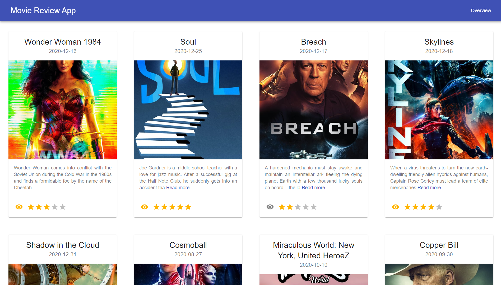

<br />
<p align="center">
  <h1 align="center">Movie Review App </h1>

  <p align="center">
    Web app for users to rate their favorite movies
    <br />
    <a href="https://github.com/yculcarneee/movie-review-web-app/"><strong>Explore the docs »</strong></a>
    <br />
    <br />
    <a href="https://github.com/yculcarneee/movie-review-web-app/issues">Report Bug</a>
    ·
    <a href="https://github.com/yculcarneee/movie-review-web-app/issues">Request Feature</a>
    ·
    <a href="https://github.com/yculcarneee/movie-review-web-app/pulls">Send a Pull Request</a>
  </p>
</p>


<!-- TABLE OF CONTENTS -->
## Table of Contents

- [Table of Contents](#table-of-contents)
- [About The Project](#about-the-project)
  - [Built With](#built-with)
- [Getting Started](#getting-started)
  - [Prerequisites](#prerequisites)
  - [Installation](#installation)
- [Contact](#contact)
- [Resources used in development](#resources-used-in-development)
<br/><br/>
<!-- ABOUT THE PROJECT -->
## About The Project



Movie Review App is a web app using which users can keep track of the movies they watched and give ratings to movies. Movie Review App uses the TMDB API to fetch the most popular movies. You can read more it [here](https://developers.themoviedb.org/3/getting-started/introduction).

### Built With
* [React](https://reactjs.org/)
* [Django](https://www.djangoproject.com/)
* [PostgreSQL](https://www.postgresql.org/)
* [Jest](https://jestjs.io/)
* [React Testing Library](https://testing-library.com/docs/react-testing-library/intro/)


<!-- GETTING STARTED -->
## Getting Started

To get a local copy up and running follow these simple example steps.

### Prerequisites

* npm
```sh
npm install npm@latest -g
```
* Python  

  You can download the latest version of Python [here](https://www.python.org/downloads/)

* PostgreSQL  
  
    You can download a suitable PostgreSQL installer from [here](https://www.postgresql.org/download/)

* pgAdmin  

    pgAdmin is used for administration of a PostgreSQL database. You can download the latest version from [here](https://www.pgadmin.org/download/)

### Installation

1. Sign up forr an account at [TMDB](https://www.themoviedb.org/) and get an API key by going to the API section in [Settings](https://www.themoviedb.org/settings/api)
   
2. Clone the repo
```sh
git clone https://github.com/yculcarneee/movie-review-web-app.git
```
3. Install NPM packages in `movie_review_app_frontend/` directory
```sh
npm install
```
4. Install Python packages in `movie_review_app_backend/` directory
```
pip install -r requirements.txt
```
5. Install PostgreSQL and pgAdmin from the link and set up your Postgres account.
   
6. Create an `.env` file in `movie_review_app_backend/` directory and paste details as follows 
```
TMDB_API_KEY=<Your API Key>
POSTGRES_USER=<Your Postgres username>
POSTGRES_PASSWORD=<Your Postgres password>
```

<!-- USAGE EXAMPLES
## Usage

Use this space to show useful examples of how a project can be used. Additional screenshots, code examples and demos work well in this space. You may also link to more resources.

_For more examples, please refer to the [Documentation](https://example.com)_ -->

<!-- CONTACT -->
## Contact

Yash Kulkarni - [LinkedIn](https://www.linkedin.com/in/yashkulkarni97/) - yukulkar@uci.edu

Project Link: [https://github.com/yculcarneee/movie-review-web-app](https://github.com/yculcarneee/movie-review-web-app)

<!-- ACKNOWLEDGEMENTS -->
## Resources used in development
* [Integrating Django with React](https://medium.com/dev-genius/integrating-django-with-react-ff596e764bdc)
* [Using React Testing Library for testing React components](https://www.robinwieruch.de/react-testing-library)
* [YouTube playlist for Django unit testing](https://youtube.com/playlist?list=PLbpAWbHbi5rMF2j5n6imm0enrSD9eQUaM)
* [Mocking Fetch API Calls in Jest](https://github.com/jefflau/jest-fetch-mock)

